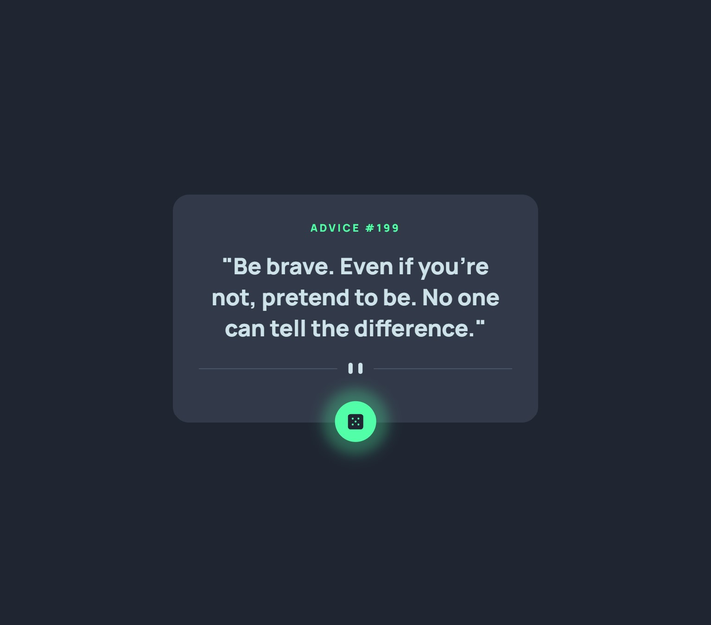

# Frontend Mentor - Advice generator app solution

This is a solution to the [Advice generator app challenge on Frontend Mentor](https://www.frontendmentor.io/challenges/advice-generator-app-QdUG-13db). 

### The challenge

The challenge is to build out this app using the [Advice Slip API](https://api.adviceslip.com/) and get it looking as close to the design as possible. Users should be able to:

- View the optimal layout for the app depending on their device's screen size
- See hover states for all interactive elements on the page
- Generate a new piece of advice by clicking the dice icon

### Screenshot

- Mobile design

- Desktop + hover design

### Links

- Solution URL: [Here](https://github.com/ritatanght/advice-generator-app)
- Live Site URL: [Here](https://fm-advice-generator-app.netlify.app/)

### Built with

- Semantic HTML5 markup
- CSS custom properties
- Flexbox
- CSS Grid
- [React](https://reactjs.org/) - JS library
